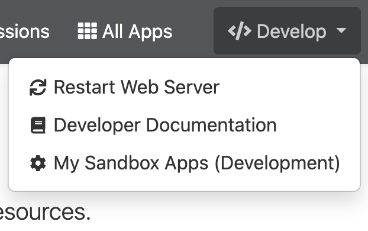

# Open OnDemand Contributor Guide
## Set up your development environment
We introduce two simple ways to set up your OOD development environment: set up a sandbox and set up an OOD Docker container.  
### Set up a sandbox for app development
If you have access to an Open OnDemand portal, the easiest way to set up your development environment is to open a sandbox. 

**Note:** Before you can use the OOD sandbox development environment, it must be enabled by the OOD administrator. This mode allows you to create and test custom web applications directly from your home directory in an isolated space. Contact your OOD adminstrator if you don't see the "Develop" menu after step 1.  

1. Create the Development Folder: If you don't see the "Develop" menu in your dashboard, you typically need to create a specific directory in your terminal to signal the system:

```{bash}
mkdir -p ~/ondemand/dev
```

2. Open the Dashboard: Log in to the Open OnDemand portal.

3. Navigate to Sandbox: In the top navigation bar, click the "Develop" menu and select "My Sandbox Apps (Development)".



4. Launch Your App: From this page, you can see a list of applications currently in your ~/ondemand/dev folder. Click Launch next to an app to start its session in a new tab.

### Set up an OOD Docker container for app development


## Initializers

Open OnDemand Dashboard initializers are Ruby files located in `/etc/ood/config/apps/dashboard/initializers`. 
They are loaded when the Dashboard starts and provide a convenient way to customize or 
extend Dashboard behavior without modifying the Open OnDemand source code. Initializers can be used to change 
application settings, add site-specific logic, or customize how Dashboard features are initialized.

### Add user specified paths to Files 
As the OOD Administrator, create a file `/etc/ood/config/apps/dashboard/initializers/user_paths.rb` with the following code:

```{ruby}
Rails.application.config.after_initialize do
  OodFilesApp.candidate_favorite_paths.tap do |paths|
    user = User.new.name
    fav_path = File.join(Dir.home(user), "ondemand", "favorite_path.txt")

    if File.file?(fav_path)
      File.foreach(fav_path) do |line|
        path = line.strip
        paths << FavoritePath.new(path) unless path.empty?
      end
    end
  end
end
```

Once the file is in place, users can add any paths they would like to list under `Files` 
as follows:
1. Add the paths to `$HOME/ondemand/favorite_path.txt`, one path per line.
2. Restart their PUN by clicking `Develop`->`Restart Web Server`. 

